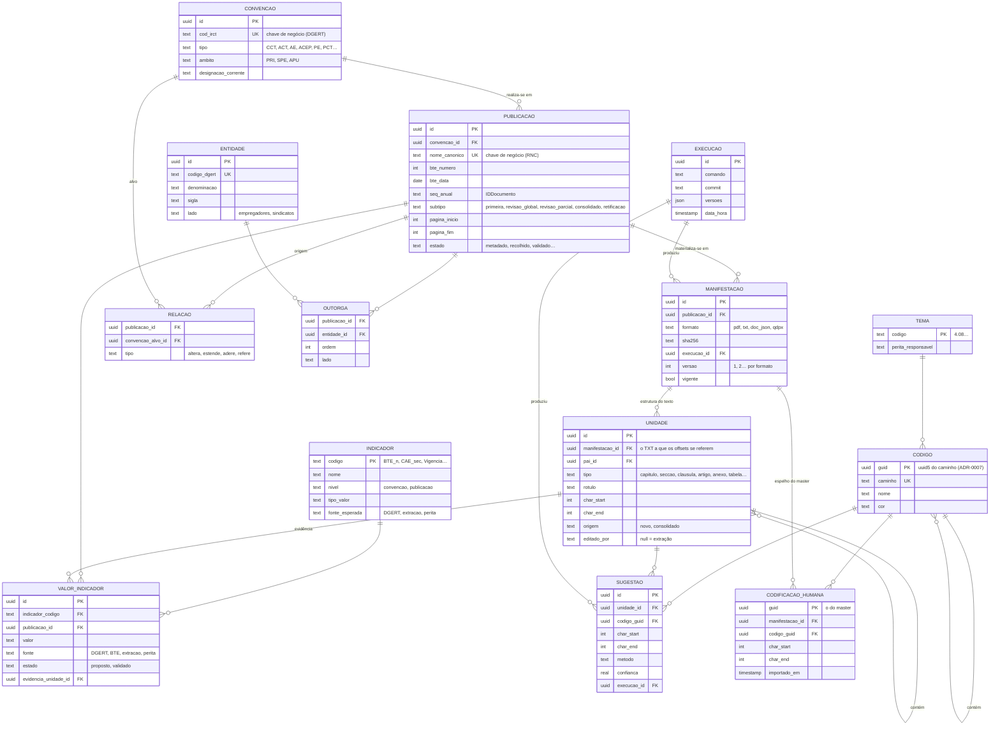

# Modelo de dados da BD operacional — rascunho para reação (#14)

> **Estado: protótipo.** Este documento responde ao pedido do issue #14: um rascunho
> concreto do modelo, com diagrama e definição das entidades, para a equipa reagir. Não é
> um DDL nem uma decisão. As escolhas que cabem à equipa estão reunidas no fim, em
> «Perguntas para a sessão». Mapa: #10. Desbloqueia: #20 (dicionário de indicadores).

## 1. Do que parte

As decisões de partida fixadas no mapa (#10) e no #14:

- **Verdade repartida.** A BD operacional é a fonte de verdade para textos, estrutura e
  metadados. O projeto master do MaxQDA é a fonte de verdade para as codificações
  humanas. O QDPX é a ponte. O Excel e as outras saídas são derivados descartáveis.
- **Núcleo documental e indicadores, ambos de primeira classe.** As variáveis de
  documento (BTE_n, data, tipo, CAE, outorgantes, trabalhadores abrangidos…) e as
  variáveis derivadas do texto (vigência, eficácia, sobrevigência, prazo de denúncia…)
  não são colunas soltas numa tabela de documentos.
- **FRBR, alinhado com o PRT2030.** Work = a convenção; Expression = cada publicação ou
  revisão no BTE; Manifestation = PDF, TXT, JSON, QDPX. UUID técnico mais chave de
  negócio. Nenhuma entidade do PRT que a aplicação não use.
- **O objetivo operacional:** deixar de repetir a extração e o *linting* a cada ajuste.
  Uma correção feita na BD (um título, uma fronteira de cláusula, uma variável) fica
  feita; uma nova extração cria uma versão nova, e não apaga o que foi corrigido.

E do que a aplicação já guarda hoje, em ficheiros (ver §5): o registo da recolha
(`data/registo/registo_bte.jsonl`), o catálogo (`catalogo_irct_AAAA.csv`), o `doc.json` de
cada extração, os livros de códigos em YAML e o master `.qdc`, os vocabulários
(`vocabularios/`), as variáveis exportadas do MaxQDA e o `manifest.json` de cada corrida.
A BD SQLite prevista no ADR-0001 nunca chegou a existir: hoje tudo vive em ficheiros.

## 2. Diagrama

## 3. As entidades

### 3.1 Núcleo documental (FRBR)

**Convenção** *(Work)*. O instrumento que atravessa as revisões. A chave de negócio é o
`cod_irct` da DGERT, estável face às mudanças de denominação. A DGERT avisa que o título
corresponde à alteração mais recente, e por isso a designação é um atributo corrente e
não uma identidade. Guarda o tipo (CCT, ACT, AE; ACEP e ACT da função pública, com
depósito na DGAEP; PE e PCT, que são não negociais) e o âmbito (PRI, SPE, APU), que hoje o
catálogo deduz (`ambito`, `ambito_origem`).

**Publicação** *(Expression)*. Cada publicação no BTE: a primeira convenção, uma revisão
global ou parcial, um texto consolidado, uma retificação. A chave de negócio é o
`nome_canonico` do RNC, que não muda depois de atribuído (docs/rnc/README.md, princípio 2). A
alternativa natural seria `(ano, bte_numero, seq_anual)`, a partir do `IDDocumento`. Hoje
isto está repartido entre o registo da recolha, uma linha por aquisição, e o catálogo,
uma linha por documento catalogado.

**Relação**. As ligações entre publicações e convenções que o catálogo já regista
(`relacao`, `relacao_alvo`, `altera_estruturado`): altera, estende (portaria de extensão),
adere (acordo de adesão), refere (aviso). Hoje uma retificação é um subtipo da
publicação e não uma relação; é uma das coisas a confirmar. Ficam numa entidade própria porque uma
publicação pode ter várias (`cod_irct_base_adicionais`). O alvo é a Convenção, e não uma
Publicação: uma revisão altera o instrumento, não uma publicação em particular. Os
guias ELI do repositório fazem o mesmo (`eli:changes`, `eli:consolidates`).

**Manifestação** *(Manifestation)*. Cada ficheiro de uma publicação: o PDF do BTE, o TXT
canónico, o `doc.json`, o QDPX de um lote. Com o SHA-256 e a execução que o produziu, que
hoje estão no `manifest.json`. É aqui que o modelo responde ao objetivo operacional: uma
nova extração cria uma **versão nova** do TXT, e a versão corrigida à mão continua a ser a
vigente até alguém decidir o contrário.

**Unidade**. A estrutura do texto: capítulos, secções, cláusulas, artigos, anexos,
tabelas, blocos (os nós do `doc.json`). Os offsets referem-se a uma Manifestação TXT
concreta, e não à Publicação, porque dois textos da mesma publicação (duas extrações)
não têm os mesmos offsets. Duas diferenças face ao `doc.json` de hoje:

- o identificador passa a ser um UUID estável, e não `n0, n1…`, que se regeneram a cada
  extração. Uma sugestão, uma evidência ou uma correção apontam para uma unidade que não
  muda de nome;
- `editado_por` distingue a unidade que veio da extração da que uma pessoa corrigiu.

### 3.2 Agentes

**Entidade**. As organizações outorgantes, com a chave `codigo_dgert` de
`vocabularios/siglas_organizacoes.csv` (2403 organizações, com sigla, lado e atividade).
Hoje os outorgantes de cada documento são uma cadeia de texto (`outorgantes`,
`n_outorgantes`). **Outorga** liga a publicação a cada entidade, com a ordem e o lado,
que o nome canónico já usa (a primeira patronal e a primeira sindical).

### 3.3 Indicadores

**Indicador**. A definição de cada variável: a entrada do dicionário do #20 (código, nome,
tipo de valor, nível, polaridade, quando apurar, fonte esperada). É uma tabela de dados, e
não um conjunto de colunas. Um indicador novo é uma linha nova, sem mudar o esquema.

**Valor de indicador**. O valor de um indicador para uma publicação, com a sua origem
(DGERT, índice do BTE, extração, perita), o estado (proposto ou validado) e, quando vem do
texto, a **evidência**: a unidade e o excerto de onde saiu. É o que permite responder a
«de onde veio esta vigência?» e deixar a perita validar sem voltar ao PDF. As variáveis
que hoje vêm do MaxQDA (`cct/variaveis.py`: `Num_BTE`, `Data_pub`, `Tipo_conv`,
`EtiquetaCAE_rev4`, `Entidade_patronal_1`, `Num_trab_abrangidos`, `Amb_Geografico`,
`SetorPublicoEmpresarial`…) passam a ser valores com a fonte `maxqda`, até a BD as ter
todas.

A CAE precisa de versão: a Rev.4 aplica-se desde 1 de janeiro de 2025 e a Rev.3 até ao
fim de 2024 (docs/research/irct-portugueses-eli-eli-dl-akn4eu.md, C.2). Os vocabulários
controlados (CAE, tipos, estados, NUTS) ficam como tabelas de referência, fora do
diagrama.

### 3.4 Codificação

**Tema** e **Código**. O livro de códigos: os temas de `vocabularios/temas.csv` e a
árvore de códigos dos YAML e do master `.qdc`. O GUID de cada código já é determinístico
(uuid5 do caminho, ADR-0007), o que torna a importação idempotente.

**Sugestão**. O que a codificação automática propõe (hoje `anotacoes.json` e as
seleções do QDPX): unidade, offsets, código, método, confiança e evidência. A BD é a
fonte de verdade das sugestões, porque é ela que as produz.

**Codificação humana**. Um **espelho só de leitura** do master do MaxQDA, importado do
QDPX, com o GUID do master. Segue a verdade repartida: a BD não é a fonte das codificações
humanas, mas precisa de as ver para medir as sugestões contra o gabarito e para os
controlos pré e pós-codificação do #12.

### 3.5 Proveniência

**Execução**. Uma corrida do pipeline, com o que o `manifest.json` já regista: o
comando, o *commit*, as versões e a data. As manifestações e as sugestões apontam para a
execução que as produziu.

## 4. Identificadores

- **UUID técnico em todas as entidades**, porque as chaves de negócio podem faltar (um
  documento sem `IDDocumento` fica `por_confirmar`) ou ser corrigidas.
- **Chaves de negócio únicas onde existem:** `cod_irct` (Convenção), `nome_canonico`
  (Publicação), `codigo_dgert` (Entidade), `caminho` (Código).
- **UUID determinístico ou aleatório?** O ADR-0007 já usa o uuid5 para os códigos. Aplicado
  à Convenção e à Publicação a partir da chave de negócio, a mesma importação feita duas
  vezes daria os mesmos UUID. A contrapartida: uma chave de negócio corrigida mudaria o
  UUID. Fica como pergunta.
- **URI ELI:** o template `/eli/irct/{tipo}/{ano}/{id-natural}/…` dos guias do repositório
  pode derivar-se destas chaves (`cod_irct` como identificador natural), sem ser guardado
  como identidade enquanto não houver espaço de nomes oficial.

## 5. De onde vem cada entidade hoje

| Entidade | Hoje | Onde |
|---|---|---|
| Convenção | `cod_irct`, `acto_negociacao`, `tipo_documento`, `ambito` no catálogo | `cct/catalogo.py` |
| Publicação | uma linha do catálogo; o registo da recolha (`chave`, `num_bte`, `data_bte`, `nomeacao`) | `cct/catalogo.py`, `cct/recolha.py` |
| Relação | `relacao`, `relacao_alvo`, `altera_estruturado`, `cod_irct_base(_adicionais)` | `cct/catalogo.py` |
| Manifestação | PDF em `data/raw/bte/`, TXT e `doc.json` de cada corrida, QDPX por lote | `cct/pipeline_tema.py`, `cct/qdpx.py` |
| Unidade | `nos` do `doc.json` (`tipo`, `rotulo`, `char_start`, `char_end`, `pai`, `origem`) | `cct/extractor.py` (`estruturar`), `cct/schemas.py` |
| Entidade, Outorga | `vocabularios/siglas_organizacoes.csv`; `outorgantes` em texto | `cct/nomeacao.py` |
| Indicador | seis entradas no dicionário de 2026 (#20) | fora do repositório |
| Valor de indicador | `VariaveisDocumento*.xlsx` do MaxQDA; campos do índice do BTE (CAE, sectores) | `cct/variaveis.py`, `cct/recolha.py` |
| Tema, Código | `vocabularios/temas.csv`, `codebooks/*.yaml`, master `.qdc` | `cct/qdc.py`, `cct/qdpx.py` |
| Sugestão | anotações da codificação lexical; seleções do QDPX | `cct/lexical.py`, `cct/qdpx.py` |
| Codificação humana | só no master do MaxQDA | — |
| Execução | `manifest.json` de cada corrida | `cct/proveniencia.py` |

## 6. Fora do modelo, de propósito

- As entidades do PRT2030 que a aplicação não usa (processo negocial ELI-DL, votações das
  comissões paritárias, jurisprudência). Entram quando houver um uso.
- Os exemplares (o quarto nível do FRBR): uma cópia de um PDF não é informação.
- As saídas Excel, que continuam derivadas e descartáveis.

## 7. Perguntas para a sessão

1. **A Publicação ou a Convenção como unidade dos indicadores?** A vigência e a
   sobrevigência são da convenção, num momento; a tabela salarial é de uma revisão. A
   proposta põe o valor na Publicação, com o nível no Indicador. Chega, ou alguns
   indicadores precisam de datas de validade próprias (em vigor de… até…)?
2. **O texto consolidado é uma Publicação (quando o BTE o publica) ou uma vista
   calculada** a partir das revisões? O BTE publica alguns; outros teriam de ser
   construídos.
3. **Onde se corrige o texto:** na BD, com a unidade marcada `editado_por`, ou continua a
   corrigir-se só no MaxQDA? Da resposta depende se a Manifestação TXT tem versões
   editáveis.
4. **UUID determinístico (uuid5 da chave de negócio) ou aleatório** para a Convenção e a
   Publicação (§4)?
5. **As codificações humanas entram na BD** como espelho do master (a proposta), ou
   ficam só no MaxQDA e são lidas do QDPX quando for preciso?
6. **Tecnologia:** o SQLite do ADR-0001 chega para este modelo; a escolha fica para o #16.
