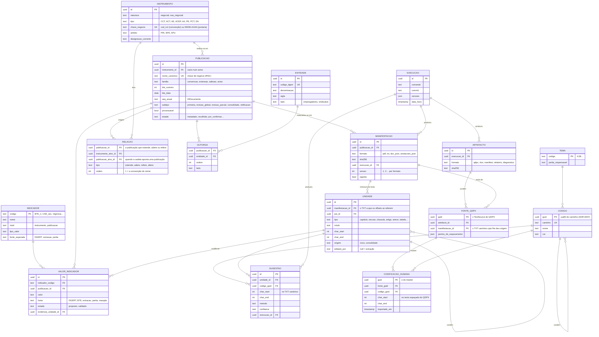

# Modelo de dados da BD operacional — rascunho para reação (#14)

> **Estado: protótipo.** Este documento responde ao pedido do issue #14: um rascunho
> concreto do modelo, com diagrama e definição das entidades, para a equipa reagir. Não é
> um DDL nem uma decisão. As escolhas que cabem à equipa estão reunidas no fim, em
> «Perguntas para a sessão». Mapa: #10. Desbloqueia: #20 (dicionário de indicadores).

## 1. Do que parte

As decisões de partida fixadas no mapa (#10) e no #14:

- **Verdade repartida.** A BD operacional é a fonte de verdade para textos, estrutura e
  metadados. O projeto master do MaxQDA é a fonte de verdade para as codificações
  humanas. O QDPX é a ponte. O Excel e as outras saídas são derivados descartáveis.
- **Núcleo documental e indicadores, ambos de primeira classe.** As variáveis de
  documento (BTE_n, data, tipo, CAE, outorgantes, trabalhadores abrangidos…) e as
  variáveis derivadas do texto (vigência, eficácia, sobrevigência, prazo de denúncia…)
  não são colunas soltas numa tabela de documentos.
- **FRBR, alinhado com o PRT2030.** Work = o instrumento (a convenção, a portaria, o
  acordo de adesão); Expression = cada publicação no BTE; Manifestation = cada ficheiro
  de uma publicação. UUID técnico mais chave de negócio. Nenhuma entidade do PRT que a
  aplicação não use.
- **O objetivo operacional:** deixar de repetir a extração e o *linting* a cada ajuste.
  Uma correção feita na BD (um título, uma fronteira de cláusula, uma variável) fica
  feita; uma nova extração cria uma versão nova, e não apaga o que foi corrigido.

E do que a aplicação já guarda hoje, em ficheiros (ver §5): o registo da recolha
(`data/registo/registo_bte.jsonl`), o catálogo (`catalogo_irct_AAAA.csv`), os ficheiros de
cada documento (`.txt`, `.doc.json`, `.anotacoes.json`), os ficheiros de cada corrida
(`projeto.qdpx`, `sugestoes_peritas.xlsx`, `manifest.json`), os livros de códigos em YAML
e o master `.qdc`, os vocabulários (`vocabularios/`) e as variáveis exportadas do MaxQDA.
A BD SQLite prevista no ADR-0001 nunca chegou a existir: hoje tudo vive em ficheiros.

## 2. O fluxo que o modelo tem de representar

Dois caminhos produzem os mesmos dados, com uma diferença que importa ao modelo:

- `python -m cct.cli extrair | codificar | exportar` escreve **por documento** o
  `{doc_id}.txt`, o `{doc_id}.doc.json` e o `{doc_id}.anotacoes.json`, e depois exporta
  uma pasta inteira de documentos para **um** QDPX (`cct/cli.py`);
- `python -m cct.pipeline_tema` faz o mesmo em memória e escreve só os ficheiros **da
  corrida**: um `projeto.qdpx` com todos os PDF da corrida (`exportar_qdpx(itens, …)`), o
  `sugestoes_peritas.xlsx`, o `relatorio.txt`, o `diagnostico.md` e o `manifest.json`
  (`cct/pipeline_tema.py`).

Um QDPX, um XLSX ou um manifesto não pertencem, portanto, a uma publicação: pertencem a
uma execução e contêm várias publicações. E o texto de cada documento dentro do QDPX não
é o TXT canónico: `cct/qdpx.py` insere linhas em branco antes das cláusulas e das secções, à volta das tabelas e
das assinaturas (`pontos_de_espacamento`) e remapeia os offsets. As codificações feitas
no MaxQDA estão nesse texto espaçado.

Quanto aos instrumentos: só a família `convencao` passa da fase 1. As portarias de
extensão e os acordos de adesão são recolhidos, nomeados e catalogados, mas não
extraídos, e referem-se sempre a uma convenção. Uma portaria pode estender várias:
leva no nome a primeira, e as outras ficam em `cod_irct_base_adicionais`. O
`COD: (IRCT)` da própria portaria não é usado, porque não se sabe se é o da convenção ou
um código próprio. Os avisos (projeto de portaria, denúncia, caducidade) não têm pasta e
ficam ligados à portaria a que correspondem, pela convenção que ambos referem
(docs/rnc/README.md, 4.6).

## 3. Diagrama

## 4. As entidades

### 4.1 Núcleo documental (FRBR)

**Instrumento** *(Work)*. O ato que atravessa as suas publicações. Chama-se instrumento, e
não convenção, porque o BTE publica atos de naturezas diferentes e o modelo tem de os
distinguir em vez de os misturar.

- **Convenção** (natureza negocial: CCT, ACT, AE, e ACT e ACEP da função pública, estes
  com depósito na DGAEP). Atravessa as revisões, e a chave de negócio é o `cod_irct` da
  DGERT, estável face às mudanças de denominação. A DGERT avisa que o título corresponde à
  alteração mais recente, e por isso a designação é um atributo corrente e não uma
  identidade.
- **Acordo de adesão** (negocial, mas sempre sobre uma convenção). É um instrumento
  próprio, com uma só publicação, e não uma revisão da convenção a que adere.
- **Portaria de extensão** (não negocial; o mesmo vale para a PCT e a decisão arbitral).
  É um instrumento próprio, com uma só publicação no BTE (e outra no Diário da República,
  que a aplicação não recolhe). A chave de negócio é o número e o ano da portaria
  (`portaria_dr`, `NNNN-AAAA`), porque o `COD: (IRCT)` da portaria não é usado (§2).

O âmbito (PRI, SPE, APU) é hoje deduzido pelo catálogo (`ambito`, `ambito_origem`); nas
portarias e adesões fica só no catálogo e não no nome (ADR-0022).

**Publicação** *(Expression)*. Cada publicação no BTE. A chave de negócio é o
`nome_canonico` do RNC, que não muda depois de atribuído (docs/rnc/README.md,
princípio 2). A alternativa natural seria `(ano, bte_numero, seq_anual)`, a partir do
`IDDocumento`. Hoje isto está repartido entre o registo da recolha, uma linha por
aquisição, e o catálogo, uma linha por documento catalogado.

- A **revisão** de uma convenção (global ou parcial), o texto consolidado e a retificação
  são publicações do **mesmo** instrumento: a ligação é pertencer-lhe (`instrumento_id`),
  e não uma relação.
- Uma **portaria** ou uma **adesão** é a publicação do seu próprio instrumento. A ligação
  às convenções faz-se pela Relação, e por isso nunca parece uma revisão delas.
- Um **aviso** é uma publicação sem instrumento próprio (`instrumento_id` vazio), ligada
  pela Relação à convenção que refere. `processavel` e `familia` vêm do catálogo.

**Relação**. As ligações de uma publicação a outros instrumentos, que o catálogo já
regista (`relacao`, `relacao_alvo`, `cod_irct_base`, `cod_irct_base_adicionais`,
`altera_estruturado`):

- `estende`: uma linha por convenção estendida. A primeira (`ordem = 1`) é a
  `cod_irct_base`, a que vai no nome; as outras vêm de `cod_irct_base_adicionais`, pela
  ordem da cadeia. Uma portaria que estende três convenções tem três linhas, e cada
  convenção vê as portarias que a estendem;
- `adere`: da publicação do acordo de adesão à convenção;
- `refere`: de um aviso à convenção que refere;
- `altera`: a cadeia de alterações que o índice traz numa revisão
  (`CCT.20250708.321/2025`). O alvo é o instrumento e, quando a cadeia a identifica, a
  publicação concreta que é alterada (`publicacao_alvo_id`). É informação da cadeia, e
  não o que faz de uma revisão uma publicação do instrumento; isso é o `instrumento_id`.

**Manifestação** *(Manifestation)*. Cada ficheiro de **uma** publicação: o PDF do BTE, o
TXT canónico, o `.doc.json` e o `.anotacoes.json` de uma extração. Tem o SHA-256 e a
execução que o produziu. É aqui que o modelo responde ao objetivo operacional: uma nova
extração cria uma **versão nova** do TXT, e a versão corrigida à mão continua a ser a
vigente até alguém decidir o contrário. No `pipeline_tema`, que não escreve ficheiros por
documento, a manifestação TXT é o texto que a BD guarda em vez de um ficheiro.

**Unidade**. A estrutura do texto: capítulos, secções, cláusulas, artigos, anexos,
tabelas, blocos (os nós do `doc.json`). Os offsets referem-se a uma Manifestação TXT
concreta, e não à Publicação, porque dois textos da mesma publicação (duas extrações)
não têm os mesmos offsets. Duas diferenças face ao `doc.json` de hoje:

- o identificador passa a ser um UUID estável, e não `n0, n1…`, que se regeneram a cada
  extração. Uma sugestão, uma evidência ou uma correção apontam para uma unidade que não
  muda de nome;
- `editado_por` distingue a unidade que veio da extração da que uma pessoa corrigiu.

### 4.2 Agentes

**Entidade**. As organizações outorgantes, com a chave `codigo_dgert` de
`vocabularios/siglas_organizacoes.csv` (2403 organizações, com sigla, lado e atividade).
Hoje os outorgantes de cada documento são uma cadeia de texto (`outorgantes`,
`n_outorgantes`). **Outorga** liga a publicação a cada entidade, com a ordem e o lado,
que o nome canónico já usa (a primeira patronal e a primeira sindical).

### 4.3 Indicadores

**Indicador**. A definição de cada variável: a entrada do dicionário do #20 (código, nome,
tipo de valor, nível, polaridade, quando apurar, fonte esperada). É uma tabela de dados, e
não um conjunto de colunas. Um indicador novo é uma linha nova, sem mudar o esquema.

**Valor de indicador**. O valor de um indicador para uma publicação, com a sua origem
(DGERT, índice do BTE, extração, perita, MaxQDA), o estado (proposto ou validado) e,
quando vem do texto, a **evidência**: a unidade e o excerto de onde saiu. É o que permite
responder a «de onde veio esta vigência?» e deixar a perita validar sem voltar ao PDF. As
variáveis que hoje vêm do MaxQDA (`cct/variaveis.py`: `Num_BTE`, `Data_pub`,
`Tipo_conv`, `EtiquetaCAE_rev4`, `Entidade_patronal_1`, `Num_trab_abrangidos`,
`Amb_Geografico`, `SetorPublicoEmpresarial`…) passam a ser valores com a fonte `maxqda`,
até a BD as ter todas.

A CAE precisa de versão: a Rev.4 aplica-se desde 1 de janeiro de 2025 e a Rev.3 até ao
fim de 2024 (docs/research/irct-portugueses-eli-eli-dl-akn4eu.md, C.2). Os vocabulários
controlados (CAE, tipos, estados, NUTS) ficam como tabelas de referência, fora do
diagrama.

### 4.4 Codificação

**Tema** e **Código**. O livro de códigos: os temas de `vocabularios/temas.csv` e a
árvore de códigos dos YAML e do master `.qdc`. O GUID de cada código já é determinístico
(uuid5 do caminho, ADR-0007), o que torna a importação idempotente.

**Sugestão**. O que a codificação automática propõe (hoje o `.anotacoes.json`, ou as
anotações em memória no `pipeline_tema`): unidade, offsets no TXT canónico, código,
método, confiança e evidência. A BD é a fonte de verdade das sugestões, porque é ela que
as produz.

**Codificação humana**. Um **espelho só de leitura** do master do MaxQDA, com o GUID do
master. Segue a verdade repartida: a BD não é a fonte das codificações humanas, mas
precisa de as ver para medir as sugestões contra o gabarito e para os controlos pré e
pós-codificação do #12. Os offsets estão no texto espaçado do QDPX, e por isso a
codificação liga-se à Fonte QDPX, que guarda os pontos de espaçamento para os levar de
volta ao TXT canónico.

### 4.5 Execução e artefactos

**Execução**. Uma corrida, com o que o `manifest.json` já regista: o comando, o
*commit*, as versões e a data. As manifestações e as sugestões apontam para a execução
que as produziu.

**Artefacto**. Um ficheiro da **corrida**, e não de uma publicação: o `projeto.qdpx`, o
`sugestoes_peritas.xlsx`, o `manifest.json`, o relatório e o diagnóstico. Contém várias
publicações, e por isso não tem `publicacao_id`.

**Fonte QDPX**. Cada documento dentro de um QDPX: o `TextSource` com o seu GUID, o TXT
canónico que lhe deu origem e os pontos de espaçamento que `cct/qdpx.py` lhe inseriu. É
a ligação muitos-para-muitos entre um projeto QDPX e as publicações que contém, e o
sítio onde o master do MaxQDA volta a encontrar a BD.

## 5. Identificadores

- **UUID técnico em todas as entidades**, porque as chaves de negócio podem faltar (um
  documento sem `IDDocumento` fica `por_confirmar`) ou ser corrigidas.
- **Chaves de negócio únicas onde existem:** `cod_irct` ou `NNNN-AAAA` (Instrumento),
  `nome_canonico` (Publicação), `codigo_dgert` (Entidade), `caminho` (Código), o GUID do
  `TextSource` (Fonte QDPX) e o do master (Codificação humana).
- **UUID determinístico ou aleatório?** O ADR-0007 já usa o uuid5 para os códigos. Aplicado
  ao Instrumento e à Publicação a partir da chave de negócio, a mesma importação feita duas
  vezes daria os mesmos UUID. A contrapartida: uma chave de negócio corrigida mudaria o
  UUID. Fica como pergunta.
- **URI ELI:** o template `/eli/irct/{tipo}/{ano}/{id-natural}/…` dos guias do repositório
  pode derivar-se destas chaves (`cod_irct` como identificador natural de uma convenção),
  sem ser guardado como identidade enquanto não houver espaço de nomes oficial.

## 6. De onde vem cada entidade hoje

| Entidade | Hoje | Onde |
|---|---|---|
| Instrumento | `cod_irct`, `acto_negociacao`, `tipo_documento`, `familia`, `ambito`, `portaria_dr` no catálogo | `cct/catalogo.py` |
| Publicação | uma linha do catálogo; o registo da recolha (`chave`, `num_bte`, `data_bte`, `nomeacao`) | `cct/catalogo.py`, `cct/recolha.py` |
| Relação | `relacao`, `relacao_alvo`, `cod_irct_base`, `cod_irct_base_adicionais`, `altera_estruturado`, `avisos_projeto` | `cct/catalogo.py` |
| Manifestação | o PDF em `data/raw/bte/`; o `.txt`, o `.doc.json` e o `.anotacoes.json` de cada documento (`cct.cli`); no `pipeline_tema`, só em memória | `cct/cli.py`, `cct/pipeline_tema.py` |
| Unidade | `nos` do `doc.json` (`tipo`, `rotulo`, `char_start`, `char_end`, `pai`, `origem`) | `cct/extractor.py` (`estruturar`), `cct/schemas.py` |
| Entidade, Outorga | `vocabularios/siglas_organizacoes.csv`; `outorgantes` em texto | `cct/nomeacao.py` |
| Indicador | seis entradas no dicionário de 2026 (#20) | fora do repositório |
| Valor de indicador | `VariaveisDocumento*.xlsx` do MaxQDA; campos do índice do BTE (CAE, sectores) | `cct/variaveis.py`, `cct/recolha.py` |
| Tema, Código | `vocabularios/temas.csv`, `codebooks/*.yaml`, master `.qdc` | `cct/qdc.py`, `cct/qdpx.py` |
| Sugestão | anotações da codificação lexical | `cct/lexical.py` |
| Execução | `manifest.json` de cada corrida | `cct/proveniencia.py` |
| Artefacto | `projeto.qdpx`, `sugestoes_peritas.xlsx`, `relatorio.txt`, `diagnostico.md`, `manifest.json` da corrida | `cct/pipeline_tema.py`, `cct/cli.py` (`exportar`) |
| Fonte QDPX | cada `TextSource` do `project.qde`, com os pontos de espaçamento | `cct/qdpx.py` (`exportar_qdpx`, `pontos_de_espacamento`) |
| Codificação humana | só no master do MaxQDA | — |

## 7. Fora do modelo, de propósito

- As entidades do PRT2030 que a aplicação não usa (processo negocial ELI-DL, votações das
  comissões paritárias, jurisprudência). Entram quando houver um uso.
- A publicação das portarias no Diário da República, que a aplicação não recolhe; o
  número e o ano ficam como chave de negócio do instrumento.
- Os exemplares (o quarto nível do FRBR): uma cópia de um PDF não é informação.
- As saídas Excel, que continuam derivadas e descartáveis (Artefacto).

## 8. Por confirmar com dados, antes de fixar

Não são decisões da equipa: são factos que o passo 0 da SPEC-0004 (tarefa 3 do
docs/rnc/README.md, ponto 9) ainda tem de confirmar num boletim que traga portarias e
adesões.

- Se o `COD: (IRCT)` de uma portaria é o da convenção ou um código próprio. Se for
  próprio, passa a ser a chave de negócio do instrumento, em vez de `NNNN-AAAA`.
- Onde a DGCP regista a convenção de base de uma portaria e de uma adesão.
- A chave de negócio de um acordo de adesão, que hoje não tem outra além do nome canónico
  da sua publicação.

## 9. Perguntas para a sessão

1. **A Publicação ou o Instrumento como unidade dos indicadores?** A vigência e a
   sobrevigência são do instrumento, num momento; a tabela salarial é de uma revisão. A
   proposta põe o valor na Publicação, com o nível no Indicador. Chega, ou alguns
   indicadores precisam de datas de validade próprias (em vigor de… até…)?
2. **O texto consolidado é uma Publicação (quando o BTE o publica) ou uma vista
   calculada** a partir das revisões? O BTE publica alguns; outros teriam de ser
   construídos.
3. **Onde se corrige o texto:** na BD, com a unidade marcada `editado_por`, ou continua a
   corrigir-se só no MaxQDA? Da resposta depende se a Manifestação TXT tem versões
   editáveis.
4. **UUID determinístico (uuid5 da chave de negócio) ou aleatório** para o Instrumento e
   a Publicação (§5)?
5. **As codificações humanas entram na BD** como espelho do master (a proposta), ou
   ficam só no MaxQDA e são lidas do QDPX quando for preciso?
6. **Tecnologia:** o SQLite do ADR-0001 chega para este modelo; a escolha fica para o #16.
